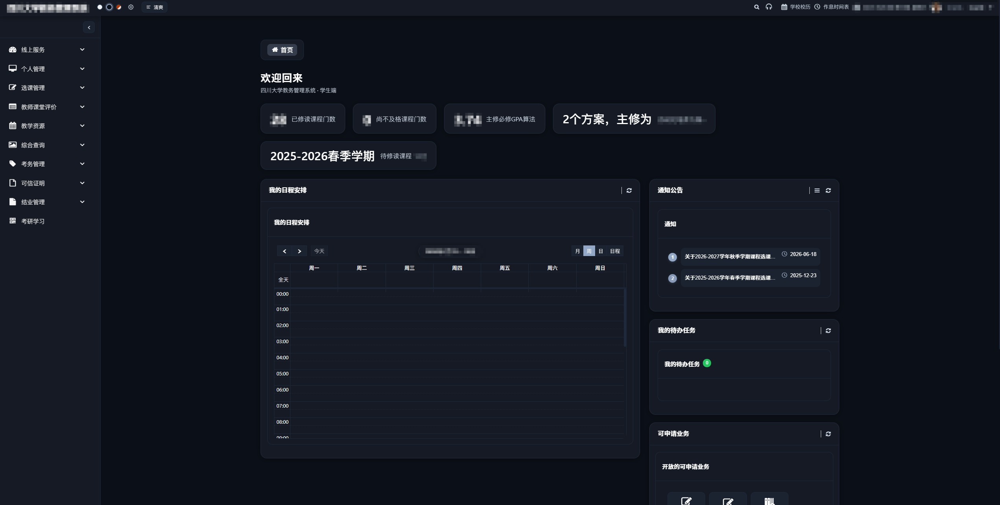
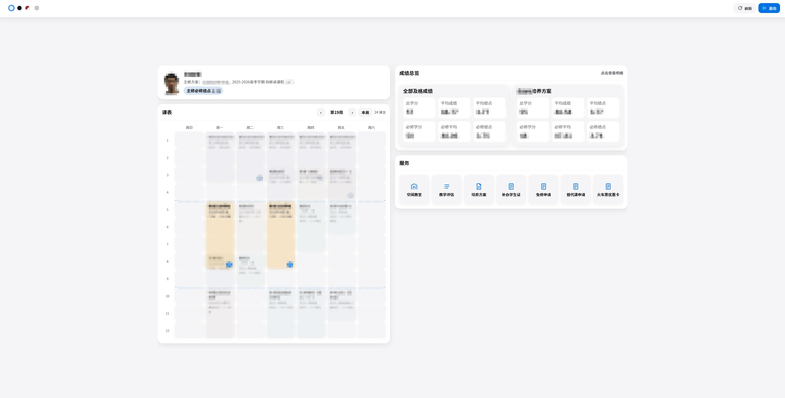
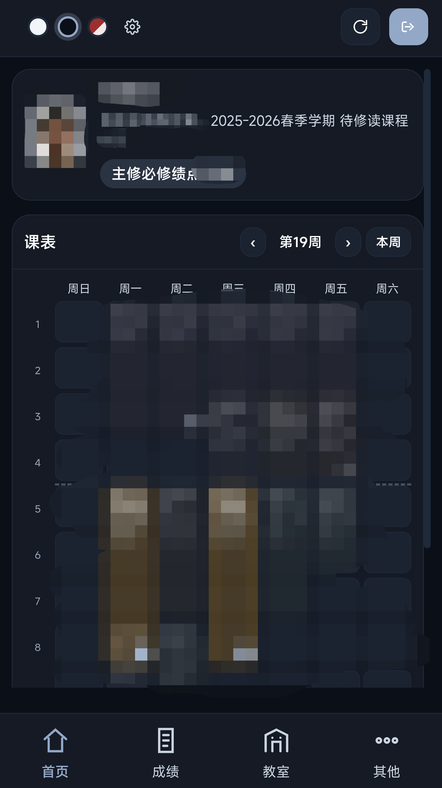

四川大学 URP 教务系统油猴脚本：全站 UI 美化 + 清爽模式聚合页。

| 脚本 | 文件 | 当前版本 |
|------|------|----------|
| 主脚本 | `urppp.user.js` | **1.0.2** |

作者：`Chao_Lan, Hanako`

> 可选辅助插件（登录 / 评教）说明见 **[README_.md](./README_.md)**。  
> 辅助插件可能存在风险，请谨慎安装；使用中出现的一切问题请自负。

---

## 效果展示

### 主站美化



### 清爽模式（桌面）



### 清爽模式（手机）



---

## 功能概览

### 主脚本 `urppp.user.js`

- **全站美化**：登录页、顶栏、侧栏、表格、表单、弹窗、分页等统一主题
- **三套主题**：简约白 / 深邃暗 / 动态配色（可自定义种子色）
- **跟随系统**：可选浅色/深色自动切换
- **清爽模式**（首页）：
  - 个人资料、本周课表（可切周）、成绩总览、服务入口
  - 成绩明细：点选 / 框选、绩点按川大现行对照表计算
  - 空闲教室：楼栋网格、今天/明天/后天、占用首字与详情
  - 手机底栏：首页 / 成绩 / 教室 / 其他
- **设置面板**：主题、跟随系统、默认进入清爽、动态配色方案
- **注意**：开发过程没有将选课界面纳入考虑范围，选课界面只有通用美化样式，考虑到选课界面对速度的要求，建议在选课期间禁用此插件；此外部分界面可能存在某些适配问题，若影响操作也请禁用此插件，见谅。

---

## 安装

1. 浏览器安装 [Tampermonkey](https://www.tampermonkey.net/)（或 Violentmonkey）
2. 安装主脚本，任选其一：
   - **Greasy Fork**：打开 [Greasy Fork](https://greasyfork.org)，搜索 **`SCU URP++`** 安装
   - 本地：打开仓库中的 `urppp.user.js` 导入 / 安装
3. 访问 [四川大学教务](http://zhjw.scu.edu.cn/login) 硬刷新

匹配域名：

- `http://zhjw.scu.edu.cn/*`
- `http://202.115.47.141/*`

---

## 使用

### 主题与设置

- 顶栏主题圆点切换主题；齿轮打开设置
- 可开「跟随系统」「默认进入清爽模式」
- 动态配色：选种子色 → 生成方案 → 可选存为预设

### 清爽模式

- 仅在**首页**显示顶栏「清爽」入口；也可在设置中默认进入
- 桌面约 1:1 双栏；窄屏切换底栏布局
- 成绩卡点进明细，可点行或拖拽框选后看学分 / 均分 / 绩点
- 空闲教室：选楼栋 → 看占用；支持今天 / 明天 / 后天

---

## 仓库结构

```text
URP++/
├── urppp.user.js              # 主脚本
├── urpppp.user.js             # 辅助插件（可选）
├── README.md                  # 主脚本说明
├── README_.md                 # 辅助插件说明与风险声明
├── LICENSE                    # MIT 开源协议
└── docs/
    ├── scu-urppp-logo.png     # 标题 Logo
    ├── Main-Page.jpg          # 效果：主站美化
    ├── Clean-Mode.jpg         # 效果：清爽模式桌面
    └── Clean-Mode-Mobile.png  # 效果：清爽模式手机
```

---

## 设计与实现要点

- 主题用 CSS 变量统一，尽量 `!important` 覆盖 ACE / Bootstrap 内联色
- 清爽模式数据走教务真实接口（课表 callback、成绩 callback、教室 `jasInfo` 等）
- 绩点：川大现行百分制对照表 + 等级制；`-999` /「未评估」不计入汇总

---

## 注意

1. 仅供个人学习与效率用途，请遵守学校教务使用规范  
2. 教务改版可能导致选择器 / 接口失效，需跟进适配  
3. 辅助插件相关风险与免责见 [README_.md](./README_.md)

---

## 开发

本地直接改 `urppp.user.js`，在 Tampermonkey 中指向文件或复制安装后硬刷新验收。

常见调试：

- 清爽模式：`window.__urpppCleanMode`

```bash
node --check urppp.user.js
```

---

## 许可

本项目采用 [MIT License](./LICENSE)。

脚本头中的 `@license MIT` 供 Tampermonkey / Greasy Fork 识别；仓库根目录的 `LICENSE` 文件供 GitHub 显示开源协议。
